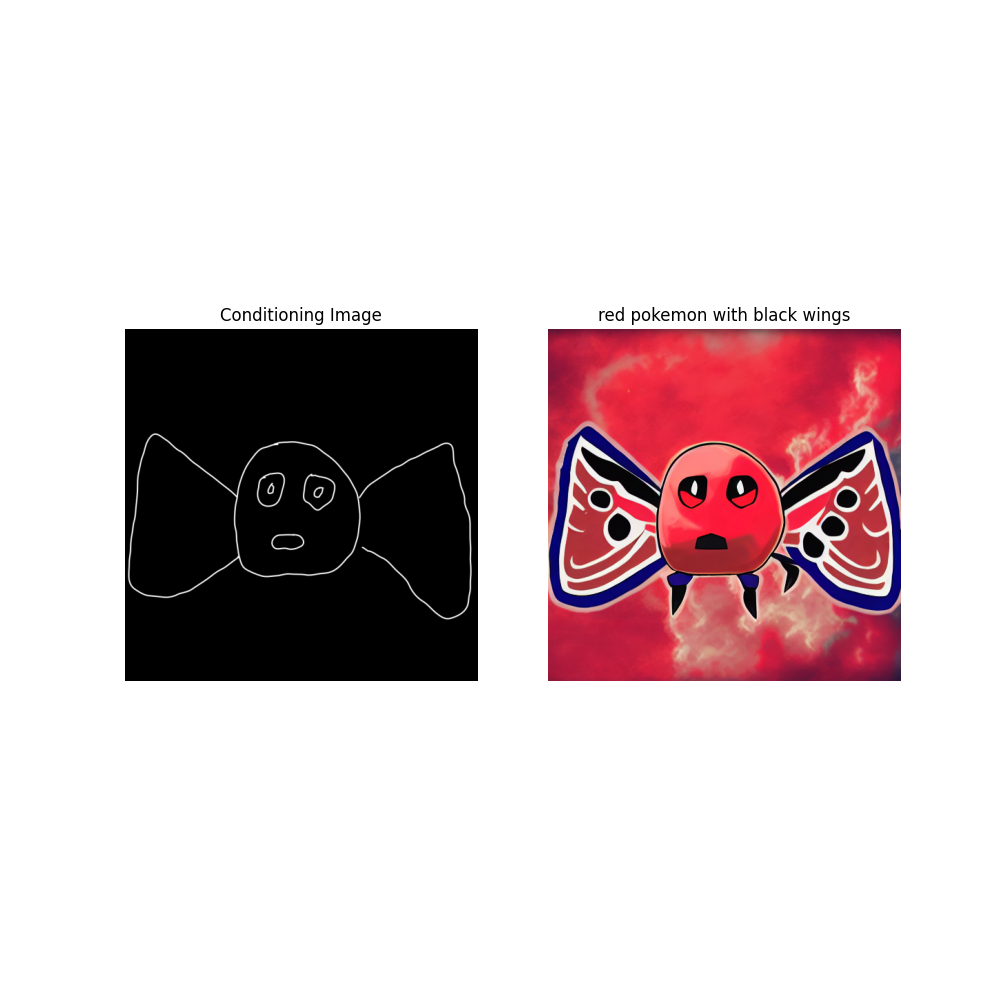
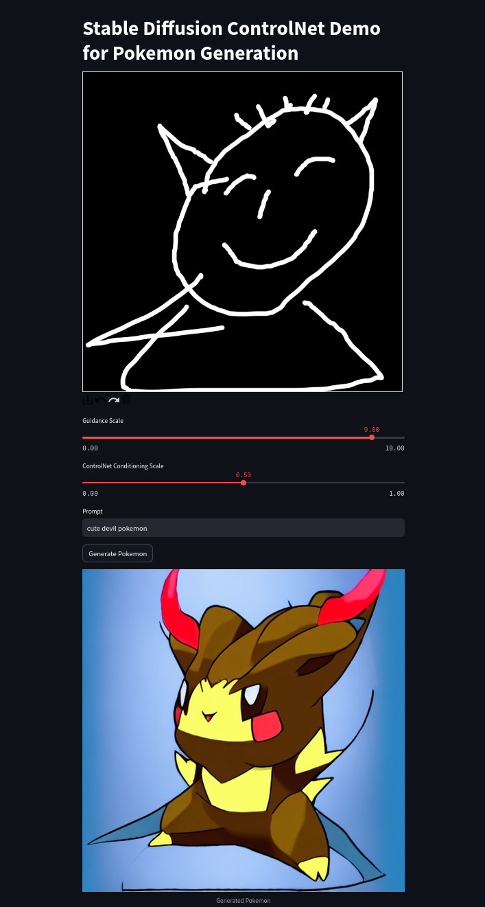

# Fine-Tuning Stable Diffusion

[]()
[](https://github.com/psf/black)
[](http://mypy-lang.org)
[](https://pycqa.github.io/isort)
[](https://mkdocstrings.github.io)
[](https://github.com/pre-commit/pre-commit)
[](https://mlflow.org)
[](https://dvc.org)
[](https://hydra.cc)
[](https://github.com/PyCQA/bandit)
[](https://github.com/pytest-dev/pytest)
[](https://github.com/commitizen-tools/commitizen)

Fine-Tuning a Stable Diffusion model on a limited amount of VRAM using a ControlNet. A dataset composed of Pokemon pictures with BLIP descriptions was modified to fine-tune Stable Diffusion 1.5. By generating sketch-like masks based on the original training set, the goal is to teach the original model to take scribbles (as well as the text prompts) as a conditioning mask for the generation of new Pokemons.

## Prerequisites

You will need:

- `python` (see `pyproject.toml` for full version)
- `Git`
- `Make`
- a `.secrets` file with the required secrets and credentials
- load environment variables from `.env`
- **A GPU with more than 8 GB of VRAM**

## Installation

Clone this repository (requires git ssh keys)

    git clone --recursive git@github.com:caetas/FineTune_SD.git
    cd finetune_sd

Install dependencies

    conda create -y -n python3.9 python=3.9
    conda activate python3.9

or if environment already exists

    conda env create -f environment.yml
    conda activate python3.9

And then setup all virtualenv using make file recipe

    (finetune_sd) $ make setup-all

## Download the Pokemon Dataset

The dataset can be downloaded from the following [link](https://huggingface.co/datasets/lambdalabs/pokemon-blip-captions). The **.parquet** file should be moved to the **data/raw** directory.

To process the images and generate the masks, please run the following command:

```bash
python prepare_dataset.py
```

The processed dataset will be stored in the **data/processed** folder.

## Train the ControlNet

Run the following commands:

```bash
chmod -X control_execute.sh
bash train_script.sh
```

**NOTE: You can skip the first command after the first execution.**

## Results

Although my input sketch is very rudimentary, the trained network can follow the provided textual and visual instructions to generate a new (very ugly) Pokemon.



You can check more examples in the [reports/figures](reports/figures/)

## Inference Mode

With a Streamlit app, you can draw your own sketch of a Pokemon and ask the pretrained ControlNet to generate an image based on your sketch and a prompt. The influence of the prompt and of the ControlNet can also be adjusted via some sliders.

```bash
streamlit run app.py
```
The interface should look like this:

<p align="center">
  
</p>

## Documentation

Full documentation is available here: [`docs/`](docs).

For more information on the Diffusers library implementation of ControlNet, you can visit the original [tutorials](https://huggingface.co/docs/diffusers/training/controlnet) 

This code was adapted from the aforementioned tutorial and from the training scripts contained in the [Diffusers Repository](https://github.com/huggingface/diffusers), more precisely in the [examples folder](https://github.com/huggingface/diffusers/tree/main/examples/controlnet).

## Dev

See the [Developer](docs/DEVELOPER.md) guidelines for more information.

## Contributing

Contributions of any kind are welcome. Please read [CONTRIBUTING.md](docs/CONTRIBUTING.md]) for details and
the process for submitting pull requests to us.

## Changelog

See the [Changelog](CHANGELOG.md) for more information.

## Security

Thank you for improving the security of the project, please see the [Security Policy](docs/SECURITY.md)
for more information.

## License

This project is licensed under the terms of the `No license` license.
See [LICENSE](LICENSE) for more details.

## Citation

If you publish work that uses Fine-Tuning Stable Diffusion, please cite Fine-Tuning Stable Diffusion as follows:

```bibtex
@misc{Fine-Tuning Stable Diffusion FineTune_SD,
  author = {None},
  title = {Fine-Tuning a Stable Diffusion model on a limited amount of VRAM.},
  year = {2023},
}
```
